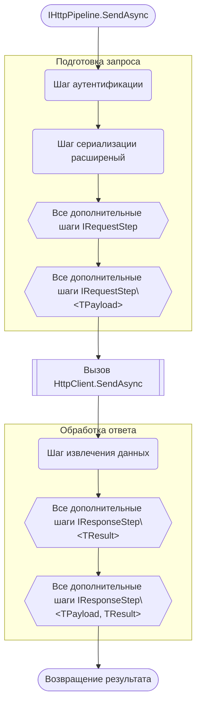
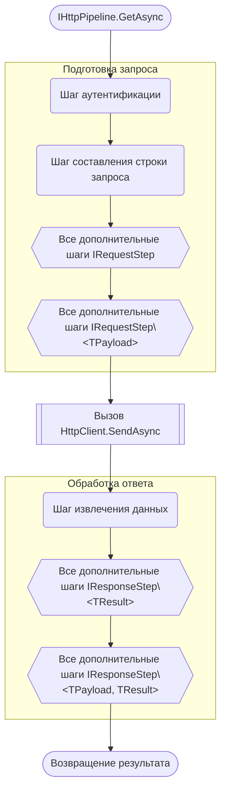
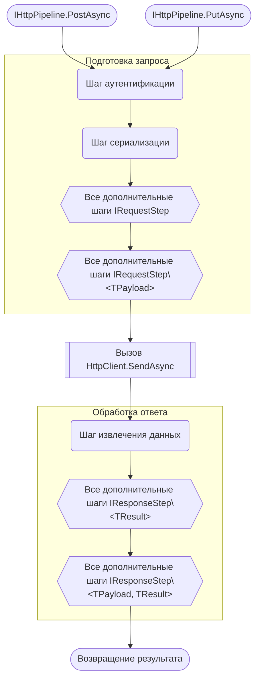

# HttPipe

##  Что такое HttPipe?

**HttPipe** - это библиотека которая упрощает работу с **HttpClient**. Основные компоненты библиотеки - это абстрактный пайплайн обработки http-запросов и удобный билдер для сбора этих пайплайнов на любой случай жизни.
Будучи C# разработчиком я давно оценил удобство такого встроенного в .Net инструмента как HttpClient. Однако у него также есть и недостатки. Можно заметить, что часто приходится конфигурировать одинаковые или очень похожие по своей структуре запросы: одинаковая сериализация, похожие строки запросов, повторяющиеся хэдеры и т.д. Это не что иное как бойлерплейт. Интуитивно в голову приходит идея: "Что если создать некую обертку для HttpClient которую можно сконфигурировать в виде: `_builder.ConfigurePost().WithIdAsQuery().WithJsonSerialization().WithStringAsResult()`, и которая будет обрабатывать запрос как конвейер". Эта библиотека и есть реализация описанной идеи.
Проблема бойлерплейта HttpClient также заключается в описании логики создания и обработки запроса в коде который выполняет другое назначение. Данная библиотека предоставляет возможность либо значительно уменьшить необходимый для настройки код, либо вынести настройку запроса в специальный класс-конфигуратор, а экземпляр пайплайна получить путем инъекции зависимостей.

## Как использовать

Для отправки запроса понадобится пайплайн. Его можно создать при помощи фабрики. Чтобы сконфигурировать пайплайн при его создании передайте лямда-выражение в котором задайте необходимые шаги в билдере. Останется вызвать у полученного экземпляра метод `SendAsync` передав в него исходные данные. Пайплайн можно переиспользовать. Когда пайплайн больше не нужен следует вызвать метод `Dispose` и высвободить таким образом используемые HttpClient'ом ресурсы.

``` CSharp
IHttpPipeline<QueryModel, Payload, Result> pipeline = HttpPipe.Create<QueryModel, Payload, Result>(
    builder => builder
    .Configure("localhost", HttpMethod.Get, default) // Задаем эндпоинт, метод запроса и опционально таймаут
    .WithoutAuthentication() // Указываем способ аутентификации
    .WithQuery() // Указываем как будет сформирована строка запроса
    .WithPayloadAsJson() // Указываем способ сериализацие тела запроса
    .WithJsonDeserialization() // Указываем способ десериализации тела ответа
    .AddHeader("If-Modified-Since", "***") // Опционально! Добавляем хэдер если необходимо
    .RemoveHeader("If-Modified-Since") // Опционально! Удаляем лишний хэдер если необходимо
    .AttachRequestStep(new SomeCustomRequestStep()) // Опционально! Добавляем свой шаг подготовки запроса в виде экземпляра IRequestStep, IRequestStep<TPayload>, IRequestStep<TQueryModel, TPayload>
    .AttachRequestStep((request, token) => Task.CompletedTask) // Опционально! Добавляем свой шаг подготовки запроса в виде лямбда-выражения
    .AttachRequestStep((payload, request, token) => Task.CompletedTask) // Опционально! Добавляем свой шаг подготовки запроса в виде лямбда-выражения
    .AttachRequestStep((query, payload, request, token) => Task.CompletedTask) // Опционально! Добавляем свой шаг подготовки запроса в виде лямбда-выражения
    .AttachResponseStep(new SomeCustomResponseStep()) // Опционально! Добавляем свой шаг обработки ответа в виде экземпляра IResponseStep<TResult>, IResponseStep<TPayload, TResult>, IResponseStep<TQueryModel, TPayload, TResult>, 
    .AttachResponseStep((result, request, response, token) => Task.FromResult(default(Result))) // Опционально! Добавляем свой шаг обработки ответа в виде лямбда выражения
    .AttachResponseStep((payload, result, request, response, token) => Task.FromResult(default(Result))) // Опционально! Добавляем свой шаг обработки ответа в виде лямбда выражения
    .AttachResponseStep((query, payload, result, request, response, token) => Task.FromResult(default(Result))) // Опционально! Добавляем свой шаг обработки ответа в виде лямбда выражения
    .ConfigureHttpClient(client => { /* do something with HttpClient */}) // Опционально! Дополнительные манипуляции с HttpClient
);
    
Result result = await pipeline.SendAsync(new QueryModel(), new Payload(), _tokenSource.Token); // Запускаем пайплайн

pipeline.Dispose(); // Освобождаем ресурсы
```

Есть три вида пайплайнов которые отличаются набором типов которые необходимы для отправки запроса:
`IHttpPipeline<TResult>`
`IHttpPipeline<TPayload, TResult>`
`IHttpPipeline<TQueryModel, TPayload, TResult>`

Кроме того, для методов `get`, `post` и `put` есть отдельные пайплайны которые немного отличаются на этапе конфигурирования:
`IGetHttpPipeline<TResult>`
`IGetHttpPipeline<TQueryModel, TResult>`
`IPostHttpPipeline<TPayload, TResult>`
`IPostHttpPipeline<TQueryModel, Tpayload, TResult>`
`IPutHttpPipeline<TPayload, TResult>`
`IPutHttpPipeline<TQueryModel, TPayload, TResult>`

## Как работает пайплайн

Под пайплайном подразумевается экземпляр класса-обертки (интерфейс `IHttpPipeline` и его производные) над экземпляром **HttpClient** которая инкапсулирует последовательность действий от получения исходных данных (если таковые предусмотрены запросом) до возвращения результата в точку вызова. Последовательность для разных типов пайплайнов будет немного отличатся, но принцип работы для них в целом схож. Проще всего это продемонстрировать на диаграмме.

#### IHttpPipeline<TQueryModel, TPayload, TResult>, IPostHttpPipeline<TQueryModel, TPayload, TResult>, IPutHttpPipeline<TQueryModel, TPayload, TResult>


#### IHttpPipeline<TPayload, TResult>



#### IHttpPipeline\<TResult>, IGetHttpPipeline\<TResult>


#### IGetHttpPipeline<TQueryModel, TResult>


#### IPostHttpPipeline<TPayload, TResult>, IPutHttpPipeline<TPayload, TResult>



## Конфигурирование пайплайнов

Вне зависимости от того каким способом создается экземпляр пайплайна конфигурирование происходит путем манипуляции над экземпляром билдера. Этот процесс содержит последовательные этапы для удобства и с целью избежать ошибок и двусмысленности некоторых этапов. Для разных билдеров последовательность этапов различается.
### Этапы конфигурирования в зависимости от типа билдера

#### ICustomHttpPipelineBuilder\<TResult>, IGetHttpPipelineBuilder\<TResult>
 


#### IGetHttpPipelineBuilder<TQueryModel, TResult>


#### ICustomHttpPipelineBuilder<TPayload, TResult>


#### IPostHttpPipelineBuilder<TPayload, TResult>, IPutHttpPipelineBuilder<TPayload, TResult>


#### ICustomHttpPipelineBuilder<TQueryModel, TPayload, TResult>, IPostHttpPipelineBuilder<TQueryModel, TPayload, TResult>, IPutHttpPipelineBuilder<TQueryModel, TPayload, TResult>


### Инициализация цепочки конфигурирования

Для инициализации начала цепочки конфигурирования пайплайна необходимо вызвать метод `Configure` у билдера. Для билдеров ассоциированных с конкретными http-методами (Get, Post, Put) необходимо указать лишь эндпоинт API и опционально таймаут запроса. Для общих билдеров необходимо дополнительно указать http-метод.

``` CSharp
var commonPipeline = HttPipe.Create<QueryModel, Payload, Result>(
	builder => builder
	.Configure("localhost", HttpMethod.Get, TimeSpan.FromSeconds(100)) // Timeout - опционально
	...);

var getPipeline = HttPipe.CreateGet<Result>(
	builder => builder
	.Configure("localhost")
	...);
```

### Шаг аутентификации

Это всегда первый шаг при подготовке запроса. Чаще всего при отправке http-запроса он будет обработан сервером только если будет содержать данные об аутентификации/авторизации. Этот шаг необходим для внедрения этой информации в запрос. Создайте класс-наследник интерфейса `IRequestStep`, определите метод `ProcessAsync` и поместите данные аутентификации/авторизации в экземпляр `RequestMessage`.

``` CSharp
internal class AuthStep : IRequestStep
{
	private readonly AuthService _service;
	public AuthStep(AuthService service)
	{
		_service = service;
	}

	public async Task ProcessAsync(HttpRequestMessage request, CancellationToken token = default)
	{
		AccessToken accessToken = await _service.GetAccessTokenAsync(token);
		request.Headers.Authorization = new AuthenticationHeaderValue("Bearer", accessToken);
	}
}

///...

var authStep = new AuthStep(_service);

var getPipeline = HttPipe.CreateGet<Result>(b => b
	.Configure("localhost")
	.WithAuthenticationStep(authStep) // Авторизация не требуется
	...);
```

Альтернативный способ - лямбда-шаг:

```CSharp
var getPipeline = HttPipe.CreateGet<Result>(b => b
	.Configure("localhost")
	.WithAuthenticationStep((request, token) =>
	{
		AccessToken accessToken = await _service.GetAccessTokenAsync(token);
		request.Headers.Authorization = new AuthenticationHeaderValue("Bearer", accessToken);
		return Task.CompletedTask;
	})
	...);
```
Если API не требует данных авторизации то следует вызвать метод `WithoutAuthentication` вместо `WithAuthenticationStep`.

### Шаг создания строки запроса

При обращении к API сервера эндпоинта почти всегда недостаточно. Довольно часто к запросу нужно добавить параметры в строку запроса. Выглядит это примерно так: `localhost/GetUser?Id="099a39c0-1b97-494d-82dc-d2eb19fc5bd0"`. 
Создайте класс-наследник `IQueryConstructionStep<TQueryModel>`, определите метод `ProcessAsync` и из полученной модели вы сможете собрать строку запроса:

``` CSharp
internal class UserQueryConstructionStep : IQueryConstructionStep<User>
{
	public Task ProcessAsync(User user, HttpRequestMessage request, CancellationToken token)
	{
		var query = $"?Id={user.Id}";
		request.RequestUri = new Uri(request.RequestUri, query);
		return Task.CompletedTask;
	}
}

///...

var getPipeline = HttPipe.CreateGet<User, Result>(b => b
	.Configure("localhost")
	.WithoutAuthentication()
	.WithQueryConstructionStep(new UserQueryConstructionStep())
	...);
```

Либо создайте лямбда-шаг:

```CSharp
var getPipeline = HttPipe.CreateGet<User, Result>(b => b
	.Configure("localhost")
	.WithoutAuthentication()
	.WithQueryConstructionStep((user, request, token) =>
	{
		var query = $"?Id={user.Id}";
		request.RequestUri = new Uri(request.RequestUri, query);
		return Task.CompletedTask;
	})
	...);
```

Чаще всего ручная сборка строки запроса избыточна и не требуется. Вместо этого вы можете вызвать метод `WithQuery` вместо `WithQueryConstructionStep` и модель которую вы передадите в качестве параметра запроса автоматически преобразуется в строку запроса. 

``` CSharp
var getPipeline = HttPipe.CreateGet<QueryModel, Result>(b => b
	.Configure("localhost")
	.WithoutAuthentication()
	.WithQuery() // Создает строку запроса с параметрами автоматически из модели
	...);
```

Эта функция требует библиотеки WebSerializer. Для корректной работы функции и для гибкого управления моделями настоятельно рекомендуется ознакомиться с [документацией](https://github.com/Cysharp/WebSerializer) данной библиотеки.

Для общего пайплайна с двумя типами параметров вместо `WithIdAsQuery` представлен метод `WithPayloadAsQuery` который выполняет тоже действие:

``` CSharp
var commonPipeline = HttPipe.Create<Payload, Result>(
	b => b
	.Configure("localhost")
	.WithoutAuthentication()
	.WithPayloadAsQuery() // Создает строку запроса с параметрами автоматически из модели полезной нагрузки
	...);
```

Такая двойственность возникает из того факта, что для общего пайплайна с этим набором типов достоверно неизвестно что будет происходить на шаге сериализации: создание строки запроса, сериализация данных в body или что-то гибридное. У пользователя есть возможность выбрать что-то конкретное или создать собственный шаг с иным поведением.

Некоторые API составленные по REST  которые требуют идетнификатор объекта ожидают другой вид строки: `localhost/GetUser/099a39c0-1b97-494d-82dc-d2eb19fc5bd0`. Если вы передаете в качестве модели `Guid` тогда для составления строки запроса будет доступен метод расширения `WithIdAsQuery` который составит строку с идентификатором автоматически:

```CSharp
var getPipeline = HttPipe.CreateGet<Guid, Result>(b => b
	.Configure("localhost")
	.WithoutAuthentication()
	.WithIdAsQuery() // "localhost/GetUser/099a39c0-1b97-494d-82dc-d2eb19fc5bd0"
	...);
```

Если по какой-то причине строка запроса не требуется необходимо вызвать метод `WithoutQuery`:

```CSharp
var getPipeline = HttPipe.CreateGet<QueryModel, Result>(b => b
	.Configure("localhost")
	.WithoutAuthentication()
	.WithoutQuery() // строка запроса с параметрами не требуется
	...);
```
> Обратите внимание, что не для каждого пайплайна предусмотрен этот шаг.

### Шаг сериализации
### Шаг десериализации
### Дополнительные шаги: окончательная настройка HttpClient
### Дополнительные шаги: шаги собственной реализации
### Дополнительные шаги: лямбда-шаги
### Доступные методы расширения
### Собственные методы расширения

## Создание экземпляров пайплайнов
### При помощи встроенной фабрики
### При помощи класса-конфигуратора
### Интеграция с DI

## Unity

## Зависимости

Newtonsoft.Json 13.0.4

WebSerializer 1.3.0

## Установка

## Совместимость

.Net Standard 2.1

## Лицензия
This library is under the MIT License.