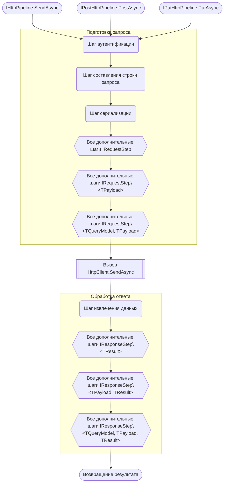
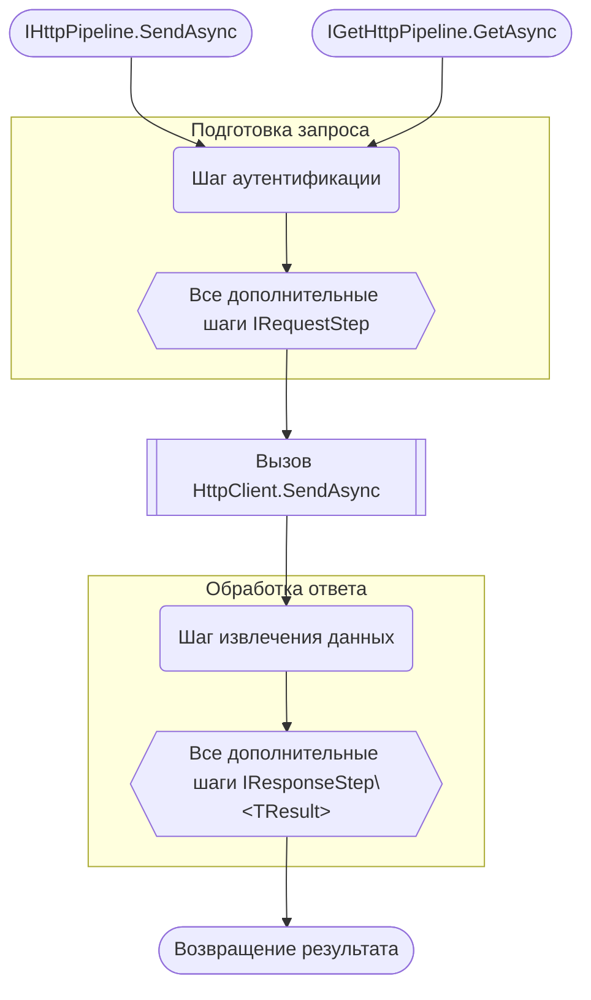

# HttPipe

##  Что такое HttPipe?

**HttPipe** - это библиотека которая упрощает работу с **HttpClient**. Основные компоненты библиотеки - это абстрактный пайплайн обработки http-запросов и удобный билдер для сбора этих пайплайнов на любой случай жизни.
Будучи C# разработчиком я давно оценил удобство такого встроенного в .Net инструмента как HttpClient. Однако у него также есть и недостатки. Можно заметить, что часто приходится конфигурировать одинаковые или очень похожие по своей структуре запросы: одинаковая сериализация, похожие строки запросов, повторяющиеся хэдеры и т.д. Это не что иное как бойлерплейт. Интуитивно в голову приходит идея: "Что если создать некую обертку для HttpClient которую можно сконфигурировать в виде: `_builder.ConfigurePost().WithIdAsQuery().WithJsonSerialization().WithStringAsResult()`, и которая будет обрабатывать запрос как конвейер". Эта библиотека и есть реализация описанной идеи.
Проблема бойлерплейта HttpClient также заключается в описании логики создания и обработки запроса в коде который выполняет другое назначение. Данная библиотека предоставляет возможность либо значительно уменьшить необходимый для настройки код, либо вынести настройку запроса в специальный класс-конфигуратор, а экземпляр пайплайна получить путем инъекции зависимостей.

## Как использовать

Для отправки запроса понадобится пайплайн. Его можно создать при помощи фабрики. Чтобы сконфигурировать пайплайн при его создании передайте лямда-выражение в котором задайте необходимые шаги в билдере. Останется вызвать у полученного экземпляра метод `SendAsync` передав в него исходные данные. Пайплайн можно переиспользовать. Когда пайплайн больше не нужен следует вызвать метод `Dispose` и высвободить таким образом используемые HttpClient'ом ресурсы.

``` CSharp
IHttpPipeline<QueryModel, Payload, Result> pipeline = HttpPipe.Create<QueryModel, Payload, Result>(
    builder => builder
    .Configure("localhost", HttpMethod.Get, default) // Задаем эндпоинт, метод запроса и опционально таймаут
    .WithoutAuthentication() // Указываем способ аутентификации
    .WithQuery() // Указываем как будет сформирована строка запроса
    .WithPayloadAsJson() // Указываем способ сериализацие тела запроса
    .WithJsonDeserialization() // Указываем способ десериализации тела ответа
    .AddHeader("If-Modified-Since", "***") // Опционально! Добавляем хэдер если необходимо
    .RemoveHeader("If-Modified-Since") // Опционально! Удаляем лишний хэдер если необходимо
    .AttachRequestStep(new SomeCustomRequestStep()) // Опционально! Добавляем свой шаг подготовки запроса в виде экземпляра IRequestStep, IRequestStep<TPayload>, IRequestStep<TQueryModel, TPayload>
    .AttachRequestStep((request, token) => Task.CompletedTask) // Опционально! Добавляем свой шаг подготовки запроса в виде лямбда-выражения
    .AttachRequestStep((payload, request, token) => Task.CompletedTask) // Опционально! Добавляем свой шаг подготовки запроса в виде лямбда-выражения
    .AttachRequestStep((query, payload, request, token) => Task.CompletedTask) // Опционально! Добавляем свой шаг подготовки запроса в виде лямбда-выражения
    .AttachResponseStep(new SomeCustomResponseStep()) // Опционально! Добавляем свой шаг обработки ответа в виде экземпляра IResponseStep<TResult>, IResponseStep<TPayload, TResult>, IResponseStep<TQueryModel, TPayload, TResult>, 
    .AttachResponseStep((result, request, response, token) => Task.FromResult(default(Result))) // Опционально! Добавляем свой шаг обработки ответа в виде лямбда выражения
    .AttachResponseStep((payload, result, request, response, token) => Task.FromResult(default(Result))) // Опционально! Добавляем свой шаг обработки ответа в виде лямбда выражения
    .AttachResponseStep((query, payload, result, request, response, token) => Task.FromResult(default(Result))) // Опционально! Добавляем свой шаг обработки ответа в виде лямбда выражения
    .ConfigureHttpClient(client => { /* do something with HttpClient */}) // Опционально! Дополнительные манипуляции с HttpClient
);
    
Result result = await pipeline.SendAsync(new QueryModel(), new Payload(), _tokenSource.Token); // Запускаем пайплайн

pipeline.Dispose(); // Освобождаем ресурсы
```

Есть три вида пайплайнов которые отличаются набором типов которые необходимы для отправки запроса:
`IHttpPipeline<TResult>`
`IHttpPipeline<TPayload, TResult>`
`IHttpPipeline<TQueryModel, TPayload, TResult>`

Кроме того, для методов `get`, `post` и `put` есть отдельные пайплайны которые немного отличаются на этапе конфигурирования:
`IGetHttpPipeline<TResult>`
`IGetHttpPipeline<TQueryModel, TResult>`
`IPostHttpPipeline<TPayload, TResult>`
`IPostHttpPipeline<TQueryModel, Tpayload, TResult>`
`IPutHttpPipeline<TPayload, TResult>`
`IPutHttpPipeline<TQueryModel, TPayload, TResult>`

## Как работает пайплайн

Под пайплайном подразумевается экземпляр класса-обертки (интерфейс `IHttpPipeline` и его производные) над экземпляром **HttpClient** которая инкапсулирует последовательность действий от получения исходных данных (если таковые предусмотрены запросом) до возвращения результата в точку вызова. 

### Концепция шагов

Если пайплайн - это конвейер обработки запроса, то "Шаги" - это атомарные его элементы. Шаги своего рода кирпичики из которых строится пайплайн. Шаг - это класс или функция основной задачей которых является либо подготовка элементов запроса (хэдеры, строка запроса, тело и т.п.), либо обработки ответа. Т.е. шаги делятся на два типа: шаги подготовки запроса и шаги обработки ответа. Первые являются наследниками интерфейсов `IRequestStep`,  `IRequestStep<TPayload>` и `IRequestStep<TQueryModel, TPayload>`, вторые - `IResponseStep<TResult>`,  `IResponseStep<TPayload, TResult>` и `IResponseStep<QueryModel, TPayload, TResult>`.
В своих целях можно реализовать шаг который наследует любой из представленных интерфейсов. Но стоит обратить внимание, что пайплайны с меньшим количеством типов не смогут работать с шагами с большим количеством типов но смогут с шагами с меньшим. Т.е. `IHttpPipeline<TQueryModel, TPayload, TResult>` может работать с любым типом шагов, а `IHttpPipeline<TPayload, TResult>` не сможет работать с шагами `IRequestStep<TQueryModel, TPayload>` и `IResponseStep<QueryModel, TPayload, TResult>` но сможет с `IRequestStep` и `IResponseStep<TResult>` наравне с `IRequestStep<TPayload>` и `IResponseStep<TPayload, TResult>`. `IHttpPipeline<TResult>` соответственно сможет работать только с `IRequestStep` и `IResponseStep<TResult>`. Ниже приведены примеры реализации шагов в виде классов:

```CSharp
// Шаг помещающий массив байт в качестве тела запроса
internal class ByteArraySerializationStep : IRequestStep<byte[]>
{
	public Task ProcessAsync(byte[] payload, HttpRequestMessage request, CancellationToken token = default)
	{
		request.Content = new ByteArrayContent(payload);

		return Task.CompletedTask;
	}
}

// Шаг который извлекает данные из тела ответа в виде строки
internal class StringResultExcludingStep : IResponseStep<String>
{
	public async Task<string> ProcessAsync(HttpRequestMessage request, HttpResponseMessage response, string result, CancellationToken token = default)
	{
		return await response.Content.ReadAsStringAsync();
	}
}
```

Кроме того, если создание класса избыточно, то в момент конфигурирования пайплайна в билдере существует возможность создать шаг в виде лямда-выражения или передать ссылку на метод.

```CSharp
// Метод-обработчик ответа
public Task<Result> Foo(Result result, HttpRequestMessage request, HttpResponseMessage response, CancellationToken token)
{
	if (response.IsSuccessStatusCode)
		_logger.Log("Success");

	return Task.FromResult(result);
}

//...

var customPipeline = HttPipe.Create<Payload, Result>(
	b => b
	...
	.AttachRequestStep((request, token) => // Шаг в виде лямда-выражения
	{
		_logger.Log("Request sent");

		return Task.CompletedTask;
	})
	.AttachResponseStep(Foo)); // Шаг в виде ссылки на метод

```

Для любого из этапов работы пайплайна возможно создать шаг обработки. Шаги можно добавлять в любом количестве.

### Последовательность работы шагов в зависимости от типов пайплайнов

Последовательность для разных типов пайплайнов будет немного отличатся, но принцип работы для них в целом схож. Проще всего это продемонстрировать на диаграмме.

#### IHttpPipeline<TQueryModel, TPayload, TResult>, IPostHttpPipeline<TQueryModel, TPayload, TResult>, IPutHttpPipeline<TQueryModel, TPayload, TResult>



#### IHttpPipeline<TPayload, TResult>


#### IHttpPipeline\<TResult>, IGetHttpPipeline\<TResult>


#### IGetHttpPipeline<TQueryModel, TResult>


#### IPostHttpPipeline<TPayload, TResult>, IPutHttpPipeline<TPayload, TResult>


## Конфигурирование пайплайнов

Вне зависимости от того каким способом создается экземпляр пайплайна конфигурирование происходит путем манипуляции над экземпляром билдера. Этот процесс содержит последовательные этапы для удобства и с целью избежания ошибок, а также двусмысленности некоторых этапов. Далее следует описание каждого из этапов.

### Этап инициализации цепочки конфигурирования

Для инициализации начала цепочки конфигурирования пайплайна необходимо вызвать метод `Configure` у билдера. Для билдеров ассоциированных с конкретными http-методами (Get, Post, Put) необходимо указать лишь эндпоинт API и опционально таймаут запроса. Для общих билдеров необходимо дополнительно указать http-метод.

``` CSharp
var customPipeline = HttPipe.Create<QueryModel, Payload, Result>(
	builder => builder
	.Configure("localhost", HttpMethod.Get, TimeSpan.FromSeconds(100)) // Timeout - опционально
	...);

var getPipeline = HttPipe.CreateGet<Result>(
	builder => builder
	.Configure("localhost")
	...);
```

### Этап аутентификации/авторизации

Это всегда первый шаг при подготовке запроса. Чаще всего при отправке http-запроса он будет обработан сервером только если будет содержать данные об аутентификации/авторизации. Этот шаг необходим для внедрения этой информации в запрос. Создайте класс-наследник интерфейса `IRequestStep`, определите метод `ProcessAsync` и поместите данные аутентификации/авторизации в экземпляр `RequestMessage`. Экземпляр созданного класса поместите как аргумент в функцию `WithAuthenticationStep`.

``` CSharp
internal class AuthStep : IRequestStep
{
	private readonly AuthService _service;
	public AuthStep(AuthService service)
	{
		_service = service;
	}

	public async Task ProcessAsync(HttpRequestMessage request, CancellationToken token = default)
	{
		AccessToken accessToken = await _service.GetAccessTokenAsync(token);
		request.Headers.Authorization = new AuthenticationHeaderValue("Bearer", accessToken);
	}
}

///...

var authStep = new AuthStep(_service);

var getPipeline = HttPipe.CreateGet<Result>(b => b
	.Configure("localhost")
	.WithAuthenticationStep(authStep) // Авторизация не требуется
	...);
```

Альтернативный способ - лямбда-шаг.  Поместите логику аутентификации/авторизации в лямда-выражение и поместите ее в качестве аргумента в метод `WithAuthenticationStep`:

```CSharp
var getPipeline = HttPipe.CreateGet<Result>(b => b
	.Configure("localhost")
	.WithAuthenticationStep((request, token) =>
	{
		AccessToken accessToken = await _service.GetAccessTokenAsync(token);
		request.Headers.Authorization = new AuthenticationHeaderValue("Bearer", accessToken);
		return Task.CompletedTask;
	})
	...);
```
Если API не требует данных авторизации то следует вызвать метод `WithoutAuthentication` вместо `WithAuthenticationStep`.

### Этап создания строки запроса

При обращении к API сервера эндпоинта почти всегда недостаточно. Довольно часто к запросу нужно добавить параметры в строку запроса. Выглядит это примерно так: `localhost/GetUser?Id="099a39c0-1b97-494d-82dc-d2eb19fc5bd0"`. 
Создайте класс-наследник `IQueryConstructionStep<TQueryModel>`, определите метод `ProcessAsync` и из полученной модели вы сможете собрать строку запроса. Затем экземпляр созданного класса нужно поместить как аргумент в функцию `WithQueryConstructionStep`

``` CSharp
internal class UserQueryConstructionStep : IQueryConstructionStep<User>
{
	public Task ProcessAsync(User user, HttpRequestMessage request, CancellationToken token)
	{
		var query = $"?Id={user.Id}";
		request.RequestUri = new Uri(request.RequestUri, query);
		return Task.CompletedTask;
	}
}

///...

var getPipeline = HttPipe.CreateGet<User, Result>(b => b
	.Configure("localhost")
	.WithoutAuthentication()
	.WithQueryConstructionStep(new UserQueryConstructionStep())
	...);
```

Либо создайте лямбда-шаг который будет аргументом метода `WithQueryConstructionStep`:

```CSharp
var getPipeline = HttPipe.CreateGet<User, Result>(b => b
	.Configure("localhost")
	.WithoutAuthentication()
	.WithQueryConstructionStep((user, request, token) =>
	{
		var query = $"?Id={user.Id}";
		request.RequestUri = new Uri(request.RequestUri, query);
		return Task.CompletedTask;
	})
	...);
```

Чаще всего ручная сборка строки запроса избыточна и не требуется. Вместо этого вы можете вызвать метод `WithQuery` вместо `WithQueryConstructionStep` и модель которую вы передадите в качестве параметра запроса автоматически преобразуется в строку запроса. 

``` CSharp
var getPipeline = HttPipe.CreateGet<QueryModel, Result>(b => b
	.Configure("localhost")
	.WithoutAuthentication()
	.WithQuery() // Создает строку запроса с параметрами автоматически из модели
	...);
```

Эта функция требует библиотеки WebSerializer. Для корректной работы функции и для гибкого управления моделями настоятельно рекомендуется ознакомиться с [документацией](https://github.com/Cysharp/WebSerializer) данной библиотеки.

Некоторые API составленные по REST  которые требуют идетнификатор объекта ожидают другой вид строки: `localhost/GetUser/099a39c0-1b97-494d-82dc-d2eb19fc5bd0`. Если вы передаете в качестве модели `Guid` тогда для составления строки запроса будет доступен метод расширения `WithIdAsQuery` который составит строку с идентификатором автоматически:

```CSharp
var getPipeline = HttPipe.CreateGet<Guid, Result>(b => b
	.Configure("localhost")
	.WithoutAuthentication()
	.WithIdAsQuery() // "localhost/GetUser/099a39c0-1b97-494d-82dc-d2eb19fc5bd0"
	...);
```

Если по какой-то причине строка запроса не требуется необходимо вызвать метод `WithoutQuery`:

```CSharp
var getPipeline = HttPipe.CreateGet<QueryModel, Result>(b => b
	.Configure("localhost")
	.WithoutAuthentication()
	.WithoutQuery() // строка запроса с параметрами не требуется
	...);
```
> Обратите внимание, что не для каждого пайплайна предусмотрен этот шаг.

### Этап сериализации

По аналогичному шаблону задается шаг который сериализует данные в тело запроса. Для добавления своей сериализации необходимо поместить класс-наследник `IRequestStep<TPayload>` как аргумент функции `WithSerializationStep` или поместить логику в лямда-функцию. Если сериализация не требуется вместо метода `WithSerializationStep` вызовите `WithoutSerialization`:

```CSharp
var customPipeline = HttPipe.Create<Payload, Result>(
	b => b
	.Configure("localhost", HttpMethod.Get)
	.WithoutAuthentication()
	.WithSerializationStep(new XMLSerializationStep()) // Собственный шаг сериализации
	...);

var customPipeline = HttPipe.Create<Payload, Result>(
	b => b
	.Configure("localhost", HttpMethod.Get)
	.WithoutAuthentication()
	.WithSerializationStep((payload, request, token) => // Собственный шаг в виде лямбда-выражения
	{
		// Логика сериализации
		return Task.CompletedTask;
	})
	);

var customPipeline = HttPipe.Create<Payload, Result>(
	b => b
	.Configure("localhost", HttpMethod.Get)
	.WithoutAuthentication()
	.WithoutSerialization() // Сериализация не требуется
	...);
```

Весьма распространенной практикой является использование `Json` в качестве протокола сериализации тела запроса. На этот случай вместо упомянутых выше методов можно воспользоваться методом расширения `WithPayloadAsJson` который автоматически преобразует полезную нагрузку в `json` и поместит его в тело запроса.

```CSharp
var customPipeline = HttPipe.Create<Payload, Result>(
	b => b
	.Configure("localhost", HttpMethod.Get)
	.WithoutAuthentication()
	.WithPayloadAsJson() // Сериализация в виде Json-строки
	...);
```

Эта функциональность обеспечивает библиотека Newtonsoft.Json. По этому настоятельно рекомендуется ознакомится с [документацией](https://www.newtonsoft.com/json) данного инструмента.

Для общего пайплайна с двумя типами параметров существует возможность использовать вместо сериализации тела запроса конструирование строки запроса. Для этого можно вызвать метод метод `WithPayloadAsQuery` который выполняет тоже действие что и `WithQuery` для пайплайнов с шагом конструирования строки. Такая двойственность возникает из того факта, что для общего пайплайна с этим набором типов достоверно неизвестно что будет происходить на шаге сериализации: создание строки запроса, сериализация данных в тело запроса или что-то гибридное. У пользователя есть возможность выбрать что-то конкретное или создать собственный шаг с иным поведением.

Кроме того, на этом этапе также предусмотрен случай когда в качестве параметра строки запроса передается идентификатор - `WithIdAdQuery`. Чтобы его использовать тип полезной нагрузки должен быть `Guid`.

``` CSharp
var customPipeline = HttPipe.Create<Payload, Result>(
	b => b
	.Configure("localhost")
	.WithoutAuthentication()
	.WithPayloadAsQuery() // Создает строку запроса с параметрами автоматически из модели полезной нагрузки
	...);
	
var customPipeline = HttPipe.Create<Guid, Result>(
	b => b
	.Configure("localhost", HttpMethod.Get)
	.WithoutAuthentication()
	.WithIdAsQuery() // "localhost/GetUser/099a39c0-1b97-494d-82dc-d2eb19fc5bd0"
	...);
```
На случай если в качестве полезной нагрузки передается `string`, `Stream` или `byte[]` то можно воспользоваться методами расширения `WithStringAsContent`, `WithStreamAsContent` и `WithByteArrayAsContent` соответственно.

```CSharp
var customPipeline = HttPipe.Create<string, Result>(
	b => b
	.Configure("localhost", HttpMethod.Get)
	.WithoutAuthentication()
	.WithStringAsContent() // Тело - строка
	...);

var customPipeline = HttPipe.Create<Stream, Result>(
	b => b
	.Configure("localhost", HttpMethod.Get)
	.WithoutAuthentication()
	.WithStreamAsContent() // Тело - поток
	...);

var customPipeline = HttPipe.Create<byte[], Result>(
	b => b
	.Configure("localhost", HttpMethod.Get)
	.WithoutAuthentication()
	.WithByteArrayAsContent() // Тело - массив байт
	...);
```

### Этап десериализации

Это первый шаг в цепочке обработки ответа. Он предназначен для извлечения данных из тела ответа. Как и на других этапах этот шаг можно задать вызвав `WithDeserializationStep` и передать в него либо экземпляр класса-наследника `IResponseStep<TResult>` в котором определен метод `ProcessAsync`, либо передать лямбда-выражение с логикой десериализации. При отсутствии необходимости извлекать данные нужно вызвать `WithoutDeserialization`.

```CSharp
var customPipeline = HttPipe.Create<Payload, Result>(
	b => b
	.Configure("localhost", HttpMethod.Get)
	.WithoutAuthentication()
	.WithStringAsContent()
	.WithDeserializationStep(new BinaryDeserializationStep()) // Шаг извлечения данных
	...);

var customPipeline = HttPipe.Create<Payload, Result>(
	b => b
	.Configure("localhost", HttpMethod.Get)
	.WithoutAuthentication()
	.WithStreamAsContent()
	.WithDeserializationStep((result, request, response, token) =>
	{
		result = // логика десериализации

		return Task.FromResult(result);
	})
	...);

var customPipeline = HttPipe.Create<Payload, Result>(
	b => b
	.Configure("localhost", HttpMethod.Get)
	.WithoutAuthentication()
	.WithStringAsContent()
	.WithoutDeserialization() // Извлечение данных не требуется
	...);
```

В случае если ответ приходит в формате `json` можно использовать метод расширения `WithJsonDeserialization`. При этом тело ответа будет автоматически преобразовано в экземпляр типа который указан в качестве результата(`TResult`). Это функция использует библиотеку Newtonsoft.Json по этому рекомендуется ознакомиться с ее [документацией](https://www.newtonsoft.com/json).

```CSharp
var customPipeline = HttPipe.Create<Payload, Result>(
	b => b
	.Configure("localhost", HttpMethod.Get)
	.WithoutAuthentication()
	.WithStringAsContent()
	.WithJsonDeserialization() // Преобразование json в TResult
	...);
```

Если тело ответа представляет собой экземпляр типа `string`, `Stream` или `byte[]` то для этих случаев предназначены методы расширения `WithStringAsResult`, `WithStreamAsResult` и `WithBiteArrayAsResult` соответственно.

``` CSharp
var customPipeline = HttPipe.Create<Payload, string>(
	b => b
	.Configure("localhost", HttpMethod.Get)
	.WithoutAuthentication()
	.WithoutSerialization()
	.WithStringAsResult() // Преобразует тело в string
	...);

var customPipeline = HttPipe.Create<Payload, Stream>(
	b => b
	.Configure("localhost", HttpMethod.Get)
	.WithoutAuthentication()
	.WithoutSerialization()
	.WithStreamAsResult() // Преобразует тело в поток данных
	...);

var customPipeline = HttPipe.Create<Payload, byte[]>(
	b => b
	.Configure("localhost", HttpMethod.Get)
	.WithoutAuthentication()
	.WithoutSerialization()
	.WithBiteArrayAsResult() // Преобразует тело в массив байт
	...);
```

> Конфигурирование будет считаться завершенным если будет вызвала любая функция на этом этапе. В ином случае при попытке создать экземпляр пайплайна возникнет ошибка `HttpPipelineBuilderException`.

### Этап завершения конфигурирования: окончательная настройка HttpClient

На случай если предоставленных инструментов недостаточно и требуется ручная настройка экземпляра `HttpClient` после этапа настройки шага десериализации есть возможность сделать это путем вызова метода `ConfigureHttpClient` и передав в него лямбда выражение в которое необходимо поместить логику манипуляции над экземпляром `HttpClient`.

```CSharp
var customPipeline = HttPipe.Create<Payload, Result>(
	b => b
	...
	.WithJsonDeserialization() // Далее следует необязательный этап
	.ConfigureHttpClient(client =>
	{
		client.MaxResponseContentBufferSize = 1024; // Ручная настройка HttpClient 
	})
	...);
```

> Обратите внимание. Если метод вызвать дважды в цепочке, то выполнится только код который содержится в последнем вызове.

> Начиная с этого этапа (этап завершения конфигурирования) порядок вызова функций билдера не имеет значения. Любые дополнительные шаги или манипуляции после этапа конфигурирования десериализации могут быть выполнены в любом порядке.

### Этап завершения конфигурирования: шаги собственной реализации

Если шагов, заданных на предыдущих этапах, не достаточно, то на этом этапе можно задать любое количество дополнительных шагов. Это происходит путем вызова функций с именами `AttachRequestStep` и `AttachResponseStep`. В качестве аргументов этих функций можно передать или экземпляры классов-шагов или соответствующие лямбда-выражения. Подробнее о создании таких шагов можно узнать в разделе **Концепция шагов**.

> На этапе завершения конфигурирования который следует после этапа извлечения данных ответа вызывать какие-либо методы не требуется если не требуется дополнительные действия при обработке запроса. Этот этап **необязателен**.

### Собственные методы расширения

В разделах выше упоминались методы расширения для билдера которые упрощают построение пайплайнов в частных случаях. Например, когда мы сталкиваемся с `json` сериализацией или когда извлекаем тело ответа в виде знакомых типов. Однако набор этих методов расширения не исчерпывающий. На случай если в вашем проекте есть типовой сценарий обработки запроса его можно также обернуть в метод расширения для определенного этапа. Например, почти наверняка будет иметь смысл сделать метод расширения для этапа аутентификации который будет актуален для любого запроса в вашем проекте.

```CSharp
// Класс представляющий собой шаг аутентификации
internal class AuthStep : IRequestStep
{
	private readonly AuthService _service;

	public AuthStep(AuthService service)
	{
		_service = service;
	}

	public async Task ProcessAsync(HttpRequestMessage request, CancellationToken token = default)
	{
		await _service.FillAsync(request, token);
	}
}

public static class HttpPipelineCustomExtensions
{
	// Определение собственного метода расширения для шага аутентификации
	public static TBuilder WithAuthService<TBuilder>(this IAuthenticationBuildingStage<TBuilder> context, AuthService service)
		=> context.WithAuthenticationStep(new AuthStep(service));
}

//...

private readonly AuthService _service;

var customPipeline = HttPipe.Create<Payload, Result>(
	b => b
	.Configure("localhost", HttpMethod.Get)
	.WithAuthService(_service) // Собственный метод расширения
	...);
```

Каждый этап представлен своим интерфейсом, соответственно метод расширения должен расширять нужный интерфейс.
| Этап | Интерфейс | Возвращаемый результат | Примечание |
|--|--|--|--|
| Аутентификации           | `IAuthenticationBuildingStage<TBuilder>` | `TBuilder` | |
| Создания строки запроса  | `IQueryBuildingStage<TQueryModel, TBuilder>` | `TBuilder` ||
| Сериализации             | `ISerializationBuildingStage<TPayload, TResult, TBuilder>` | `IDeserializationBuildingStage<TResult, TBuilder>` ||
| Сериализации расширенной | `ISerializationBuildingStageCommon<TPayload, TResult, TBuilder>` | `IDeserializationBuildingStage<TResult, TBuilder>` | Для пайплайна `IHttpPipeline<TPayload, TResult>` |
| Десериализации           | `IDeserializationBuildingStage<TResult, TBuilder>` | `TBuilder` ||
| Завершающий              | `ICompletionBuildingStageCommon<TResult, TBuilder>` | `TBuilder`  ||

Можно пойти дальше. Если в проекте есть часто повторяющиеся паттерны запросов, то в метод расширения можно обернуть всю цепочку конфигурирования.

```CSharp
public static ICompletionBuildingStage<TPayload, TResult> ConfigureTypicalPost<TPayload, TResult>(this IPostHttpPipelineBuilder<TPayload, TResult> context, Uri uri)
{
	return context
		.Configure(uri)
		.WithoutAuthentication()
		.WithPayloadAsJson()
		.WithJsonDeserialization();
}

//...

var postPipeline = HttPipe.CreatePost<Payload, Result>(
	b => b
	.ConfigureTypicalPost(new Uri("localhost"))); // Вся цепочка в одном методе
```

### Последовательность этапов конфигурирования в зависимости от типа билдера

Для разных билдеров последовательность этапов различается. Далее представлены диаграммы которые илюстрируют последовательность этапов для каждого из типов пайплайнов.

#### ICustomHttpPipelineBuilder\<TResult>, IGetHttpPipelineBuilder\<TResult>
 


#### IGetHttpPipelineBuilder<TQueryModel, TResult>


#### ICustomHttpPipelineBuilder<TPayload, TResult>


#### IPostHttpPipelineBuilder<TPayload, TResult>, IPutHttpPipelineBuilder<TPayload, TResult>


#### ICustomHttpPipelineBuilder<TQueryModel, TPayload, TResult>, IPostHttpPipelineBuilder<TQueryModel, TPayload, TResult>, IPutHttpPipelineBuilder<TQueryModel, TPayload, TResult>


## Создание экземпляров пайплайнов

Класс пайплайна не является открытым. Это значит что у пользователя не получится вручную создать экземпляр. Это обусловлено тем, что пайплайн должен быть определенным образом сконфигурирован. Вместо этого вы можем делегировать создание пайплайна встроенной фабрике и получить экземпляр скрытый за интерфейсом `IHttpPipeline`. На самом деле есть два способа создания пайплайна. Самый простой - это упомянутая фабрика. Альтернативный - создание класса-конфигуратора - директора.

### При помощи встроенной фабрики

Под фабрикой подразумевается статический класс `HttPipe`. Этот класс содержит методы для создания всех типов пайплайнов.

```CSharp
IHttpPipeline<Result> customPipeline1 = HttPipe.Create<Result>(...);
IHttpPipeline<Payload, Result> customPipeline2 = HttPipe.Create<Payload, Result>(...);
IHttpPipeline<QueryModel, Payload, Result> customPipeline3 = HttPipe.Create<QueryModel, Payload, Result>(...);

IGetHttpPipeline<Result> getPipeline1 = HttPipe.CreateGet<Result>(...);
IGetHttpPipeline<QueryModel, Result> getPipeline2 = HttPipe.CreateGet<QueryModel, Result>(...);

IPostHttpPipeline<Payload, Result> postPipeline1 = HttPipe.CreatePost<Payload, Result>(...);
IPostHttpPipeline<QueryModel, Payload, Result> postPipeline2 = HttPipe.CreatePost<QueryModel, Payload, Result>(...);

IPutHttpPipeline<Payload, Result> putPipeline1 = HttPipe.CreatePut<Payload, Result>(...);
IPutHttpPipeline<QueryModel, Payload, Result> putPipeline2 = HttPipe.CreatePut<QueryModel, Payload, Result>(...);
```

### При помощи класса-конфигуратора

Класс-конфигуратор или директор меняет подход к созданию экземпляра. Чтобы воспользоваться этим методом нужно создать класс-наследник одного из представленных абстрактных классов, например, `CustomHttpPipelineDirector`. Также как в фабрике представлены методы для создания всех типов пайплайнов, так для классы-конфигураторы есть для всех типов. Классы-конфигураторы имеет смысл использовать, например, для упрощения регистрации пайплайнов в DI-контейнерах.

```CSharp
class CustomDirector : CustomHttpPipelineDirector<QueryModel, Payload, Result>
{
	protected override void Configure(ICustomHttpPipelineBuilder<QueryModel, Payload, Result> builder)
	{
		builder
			.Configure("localhost", HttpMethod.Post, TimeSpan.FromSeconds(100))
			.WithoutAuthentication()
			.WithQuery()
			.WithPayloadAsJson()
			.WithJsonDeserialization();
	}
}

//..

CustomDirector director = new CustomDirector();

var pipeline = director.Create();
```

Ниже таблица соответствия типов пайплайнов и абстрактных классов-конфигураторов которые необходимо унаследовать чтоб создать экземпляры этих пайплайнов:

| Пайплайн | Директор |
|--|--| 
| `IHttpPipeline<TResult>` | `CustomHttpPipelineDirector<TResult>` |
| `IHttpPipeline<TPayload, TResult>` | `CustomHttpPipelineDirector<TPayload, TResult>` |
| `IHttpPipeline<TQueryModel, TPayload, TResult>` | `CustomHttpPipelineDirector<TQueryModel, TPayload, TResult>` |
| `IGetHttpPipeline<TResult>` | `GetHttpPipelineDirector<TResult>` |
| `IGetHttpPipeline<TQueryModel, TResult>` | `GetHttpPipelineDirector<TQueryModel, TResult>` |
| `IPostHttpPipeline<TPayload, TResult>` | `PostHttpPipelineDirector<TPayload, TResult>` |
| `IPostHttpPipeline<TQueryModel, TPayload, TResult>` | `PostHttpPipelineDirector<TQueryModel, TPayload, TResult>` |
| `IPutHttpPipeline<TPayload, TResult>` | `PutHttpPipelineDirector<TPayload, TResult>` |
| `IPutHttpPipeline<TQueryModel, TPayload, TResult>` | `PutHttpPipelineDirector<TQueryModel, TPayload, TResult>` |

### Интеграция с DI

Для регистрации в DI-контейнере подойдет любой из описанных выше методов. Все зависит от ваших потребностей. Ниже описаны варианты для регистрации в некоем абстрактном контейнере.

```CSharp
// !!Псевдо-код!!
// Простая регистрация в контейнере
container
	.Register<IHttpPipeline<QueryModel, Payload, Result>>()
	.FromMethod((context) => HttPipe.Create<QueryModel, Payload, Result>(...))
	.AsTransient();
```

На случай если для запроса потребуются сервисы из DI-контейнера лучше использовать  способ с классом-конфигуратором.

```CSharp
// !!Псевдо-код!!
public class CustomDirector : CustomHttpPipelineDirector<QueryModel, Payload, Result>
{
	private readonly AuthService _service;

	// Инъекция необходимых сервисов
	public CustomDirector(AuthService service)
	{
		_service = service;
	}

	protected override void Configure(ICustomHttpPipelineBuilder<QueryModel, Payload, Result> builder)
	{
		builder
			.Configure("localhost", HttpMethod.Post, TimeSpan.FromSeconds(100))
			.WithAuthenticationStep(new AuthStep(_service)) // Передача сервиса из контейнера для использования
			.WithQuery()
			.WithPayloadAsJson()
			.WithJsonDeserialization();
	}
}

//...

// Регистрируем директор в контейнере
container.Register<CustomDirector>().AsSingle();

// Регистрируем пайплай который будет создан при помощи директора
container.Register<IHttpPipeline<QueryModel, Payload, Result>>().FormMethod(container =>
{
	CustomDirector director = container.Resolve<CustomDirector>();

	return director.Create();
});
```

В последнем случае видно, что код для подобных случаев будет повторятся, по этому хорошей идеей будет создать для контейнера метод расширения для удобства.

```CSharp
// !!Псевдо-код!!
public static SomeContainer RegisterPipelineFrom<TQueryModel, TPayload, TResult, TDirector>(this SomeContainer container)
{
	container.Register<TDirector>().AsSingle();
	container.Register<IHttpPipeline<TQueryModel, TPayload, TResult>>().FormMethod(container =>
	{
		TDirector director = container.Resolve<TDirector>();

		return director.Create();
	});

	return container;
}

//...

container.RegisterPipelineFrom<QueryModel, Payload, Result, CustomDirector>();
```
> Все примеры в этом разделе представляют собой псевдо-код и иллюстрируют лишь паттерн того как следует регистрировать сущности из данной библиотеки в каком-либо DI-контейнере.

## Unity

Скоро

## Зависимости

Newtonsoft.Json 13.0.4

WebSerializer 1.3.0

## Установка

Скоро

## Совместимость

.Net Standard 2.1

## Лицензия
This library is under the MIT License.